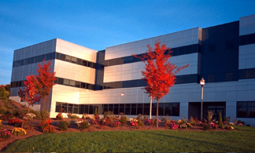

Hi there! I'm a computer science graduate student whose interests lie at the intersection of deep and traditional machine learning methodologies. A background in both Computer Vision and Responsible AI teaches one to make the best of both.

Research Labs
------
I've had the privilege to work with Professors Przemek Grabowicz and Erik Learned-Miller of the **Knowledge Discovery** and **Computer Vision** Labs respectively. 

[Knowledge Discovery Lab](https://groups.cs.umass.edu/kdl/)    |  [Computer Vision Lab](https://vis-www.cs.umass.edu)
:-------------------------:|:-------------------------:
  |  

Education
-----
I received my Bachelor's degree in Computer Science at the University of Massachusetts, Amherst, in tandem with the commonwealth honors college. Now, I'm grateful to be a [Bay state Fellow](https://www.cics.umass.edu/content/bay-state-scholarship-program) and computer science masters student at UMass Amherst on track for a Spring 2023 graduation. 

Credit to Site Template
------
Thanks to [AcademicsPages](https://github.com/academicpages/academicpages.github.io) for the creation of this GitPages template!
